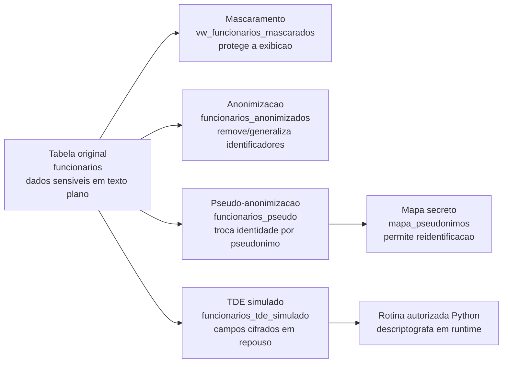

# Diagrama do Fluxo de Proteção

Este diagrama resume o que acontece com os dados em cada técnica do laboratório.

## Leitura do diagrama

- A tabela `funcionarios` representa o risco inicial: dados sensíveis em texto plano.
- A view `vw_funcionarios_mascarados` mostra dados protegidos sem alterar a tabela original.
- A tabela `funcionarios_anonimizados` remove ou generaliza identificadores.
- A tabela `funcionarios_pseudo` usa pseudonimos; a reversao depende de `mapa_pseudonimos`.
- A tabela `funcionarios_tde_simulado` armazena campos cifrados; a descriptografia autorizada acontece no Python.
